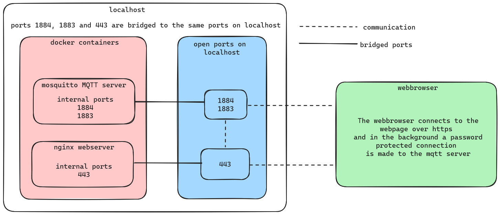

# SSL protected web chat app using MQTT

The website is hosted using nginx in a docker container. It
uses self signed ssl certificates to use https. The container port 443 is bridged to the same localhost port.

The MQTT server is also hosted in a docker container and is password protected. The container ports 1884 and 1883 are bridged to the same localhost ports.

The chat uses the MQTT protocol to automatically subscribe to a predefined topic and has a text box to publish a message to the chat.

When a user enters the chat when going to https://localhost a message is send to already connected users to notify them. 

Each user is identified by a randomized username of 10 characters which changes each time a user (re)joins the chat.

## How to start it
```bash
# docker and docker-compose need to be installed and running
cd assignment_1
docker-compose up -d
```
## The network diagram
